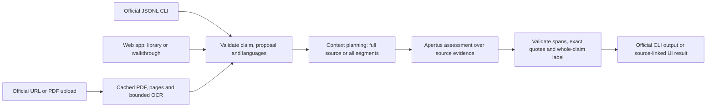

# Technical report — ClaimLens V2

- **Track:** Track 2A — OST: Multilingual Natural Language Inference over Swiss Official Voting Booklets
- **Event:** Hack Apertus Online, 1–16 October 2026
- **Team:** To be completed by the submitting team
- **Demo:** Local web app, `make dev` or Docker `make run`
- **Status:** Development prototype, 8 October 2026. Software verification, the repeated 27-case development evaluation, and the full-booklet browser check completed. Model-quality failures remain documented below.

## 1. Summary

ClaimLens connects a source-relative NLI verdict to the exact claim words and source passages behind it. V2 adds a persistent official-booklet library, URL and PDF imports, bounded local OCR, and context-aware analysis of full documents. The CLI implements OST's task A (booklet) and task B (supplied reference) contract; the web app adds highlighted explanations, original PDF page links, runtime status, coverage and usage metrics.

Local development uses an Apertus v1.5 8B text-backbone quantization. The interface also retains a clearly labeled, prewritten walkthrough that makes no model call. Working imports, exact quotations and software tests establish useful behavior; they do not establish general prediction accuracy.

## 2. Architecture and source handling

The Python modules have distinct responsibilities: `library.py` manages original PDFs and metadata; `booklets.py` extracts page text; `context.py` plans document analysis; `llm.py` implements model transport and structured output; `engine.py` checks results; `cli.py` preserves the official schema. A static HTML/CSS/JavaScript frontend uses the local HTTP API.

Web imports accept HTTPS PDF links on exactly `bk.admin.ch` or `www.bk.admin.ch`, or a raw uploaded PDF. Redirects are validated. Content hashes and language determine stable document IDs; repeated imports reuse stored bytes and preserve proposal titles. Imports do not run Apertus. The submitted predictor reads supplied inputs and local PDFs; it does not fetch booklets, models or dependencies during evaluation.

Physical, one-based PDF page positions remain intact, including blank pages. Pages with fewer than 40 non-whitespace text characters are candidates for local Poppler/Tesseract OCR. Each extraction attempts at most 20 candidate pages within a shared 180-second budget. OCR replaces text only when it recovers more than the existing scant text layer. Page-specific warnings remain visible. An exact match to an OCR transcription is not proof of an exact match to the visual PDF.

### Context and claim reasoning

When the source fits the configured context, the final assessment receives all supplied source text. Otherwise, ordered segments cover the entire source. Apertus selects potentially relevant source-unit IDs, including counter-evidence; Python reconstructs verbatim excerpts; a final pass reasons jointly over those excerpts. The application does not vote over segment labels. Original source IDs and page positions survive consolidation.

The planner reserves output tokens and a safety margin. It can count a rendered prompt through the same local runtime's `/apply-template` and `/tokenize` APIs; otherwise it records a conservative byte-based planning estimate. These estimates never replace measured usage. Exhausted context, call or time budgets produce explicit errors rather than silent truncation. Processing every segment does not guarantee that every relevant fact reaches the final pass; the UI states this limitation.

The first check must assess the entire claim and determines its label: **0 entailment, 1 neutral, 2 contradiction**. Additional checks explain amounts, dates, scope, qualifications or attribution. They are not mechanically combined, which would mishandle disjunctions and conditionals. Code derives offsets from exact claim substrings and validates quotations against original passages. Citation failures become visible unresolved checks in the UI and are rejected by the submission exporter. Structural failures reject the response. This validates provenance, not semantic correctness.

## 3. Apertus and runtime

The canonical model is `swiss-ai/Apertus-v1.5-8B`; the application also supports the official 70B ID when the endpoint supplies it. Local development uses a community Q4_K_M conversion of the 8B text backbone, **5,059,027,136 bytes**, with verified SHA256 and pinned revision. It is an unofficial derivative rather than the original multimodal checkpoint. [Local model provenance](docs/local-model.md) records the artifact.

The tested setup is llama.cpp on an Apple M4 with 16GiB RAM, Metal offload, a **16,384-token combined input/output context**, and one inference slot. The local alias is `claimlens-apertus-v1.5-8b-q4`. `LOCAL_MODEL_ID` applies only to allowlisted local endpoint hosts. Organizer-injected `BASE_URL` and `API_KEY` take precedence; remote calls retain canonical Apertus model IDs. Results distinguish the canonical model from the served alias.

Requests use temperature 0, up to 3,000 final-output tokens, and up to 1,600 output tokens for extraction passes. Local constrained decoding requires one whole-claim check, with up to three diagnostic checks, and restricts spans and quotations to source-derived candidates. Remote proxies use JSON-object mode. The prompt treats source text as data, requests supporting and conflicting evidence, and distinguishes attributed arguments or forecasts from established facts. No fine-tuning, external judge, browsing or shell tools are used by the model.

Development limits are 300 seconds per model request, 1,800 seconds per document and 48 model calls per document. The browser allows the configured document budget plus a margin. Runtime health checks query availability without running inference; a healthy endpoint is not a quality assessment.

## 4. Data and imported collection

The pinned [OST dataset](https://huggingface.co/datasets/OSTswiss/MNLIoverSwissVotingBooklets), revision `fc2b27600310778da6bbf445651ddbca22d86269`, contains **1,488 training rows**: 495 entailment, 498 neutral and 495 contradiction. All nine DE/FR/IT source/claim-language combinations occur. There are 1,153 unique requests and 335 duplicate rows, with no conflicting duplicate labels. The local snapshot, unlabeled inference inputs and gold labels are stored separately under ignored `data/local/ost/` paths. Labels are not sent to the model.

The imported collection comprises every unique booklet URL referenced by that prepared dataset, not the entire historical archive:

| Measure | Verified collection |
| --- | --- |
| Official PDFs | **60:** 20 German, 20 French, 20 Italian |
| Original PDF pages | **3,408** |
| Original PDF bytes | 75,993,354 |
| Extracted text characters | 6,144,888, including whitespace |
| Pages with recovered OCR text | **22 across 10 documents** |
| Failed imports / rejected source rows | 0 / 0 |

These counts exclude temporary verification fixtures and user uploads. Some pages still have little readable text; warnings identify them. See [library provenance and OCR setup](docs/library.md).

The bundled walkthrough uses a French reference about the 3 March 2024 retirement initiative, one original dataset claim/label, and three authored variations. Its explanations are prewritten. The source dataset declares MIT; booklets remain attributed to the Federal Chancellery. The submission image excludes walkthrough answers and gold labels.

## 5. Verification and evaluation

### Software and end-to-end checks

| Check | Completed observation |
| --- | --- |
| Unit/integration suite | **125 tests passed**, plus the frontend smoke harness. Coverage includes both CLI tasks, nine language pairs, provenance, PDF/OCR, imports, runtime configuration, context budgets and token aggregation. Test inference is stubbed. |
| Real browser | Isolated headless Chrome inspected at 1440×1050 and 390×844. Actual library selection, cached official import, synthetic PDF upload/download and offline demo passed, with no page errors or horizontal overflow. The temporary upload was removed. Earlier hierarchical-layout screenshots used marked mocks; the final live booklet screenshots contain an actual model response. |
| Docker | `linux/amd64` image build and **two task A/B integration checks** passed with a read-only root and no external network. Inference was mocked; this does not verify the organizer's endpoint. |
| OCR fixture | A separate image-only French PDF recovered text on physical page 2 while preserving the blank first-page warning. The fixture was not retained in the official library. |
| Revised full-booklet browser check | **Semantic failure:** the French 3 March 2024 booklet and German changed-number claim (`67 Jahre`, `100 %`) produced entailment (0), although pages 6/21/22 establish 66 years by 2033 and 80%. All 32 source pages were processed in two segments and three model calls: **24,820 input / 559 output tokens; 179.69 seconds**. The exact cited text passed provenance checks but did not justify the verdict. |

Recorded artifacts are in `output/v2-qa/`, `output/v2-smoke/` and their verification logs. Mocked screenshot values are not model measurements. The final browser response is preserved unchanged, including its incorrect label. It cited a page-22 footnote and headings ending with retirement at 67 in 2043, while the body explains 80% and page 21 states 66 by 2033. The response even mentioned those differences in its summary while labeling the claim supported. This demonstrates a reasoning and evidence-selection failure that structural JSON and exact-quote checks cannot detect. An earlier smoke result is retained separately; its correct class with a weak citation is not substituted for the final result.

### Task B development sample

Preparation deterministically selects **27 distinct requests**, one per label for each of the nine source/claim-language combinations. Gold labels are used for stratification and separate scoring. This is a small sample of the published training split, **not held-out evaluation**. Prompt/schema changes were informed by its observed failures, and the revised run repeats these same 27 requests. Any revised score therefore measures performance on a tuned development set.

| Run | Correct / all cases | Accepted | Failures | Macro-F1 including failures |
| --- | --- | --- | --- | --- |
| Recorded baseline | **15/27 (55.56%)** | 19 | 8 | **0.5456** |
| Revised local schema | **18/27 (66.67%)** | 27 | 0 | **0.5556** |

The baseline's eight failures were rejected structural/claim/citation outputs, not substituted neutral predictions. Four accepted classifications were incorrect. Its recorded mean case duration was 26.93 seconds, with 69,932 input and 6,549 output tokens across the 27 recorded cases. Baseline artifacts and the source snapshot remain in `output/v2-evaluation-baseline/`.

The completed revised run accepted all 27 outputs. Every language pair had two correct predictions out of three. All nine entailment and nine contradiction examples were correct; **all nine neutral examples were incorrectly classified as contradiction**. Per-class F1 was 1.000 entailment, 0.000 neutral and 0.667 contradiction. The schema removed observed format failures but did not solve the distinction between missing evidence and explicit incompatibility. This is the principal model-quality issue to address next.

The revised run averaged **24.11 seconds per case**, with **69,932 input and 6,742 output tokens**; usage was returned for all 27 cases. Completed records, run identity and the confusion matrix are in `output/v2-evaluation/`. Timings are observations on this local quantized runtime, not controlled throughput comparisons. The small, tuned sample does not establish the public Task B macro-F1 target of 0.70 on unseen cases.

The local evaluator counts failures against accuracy and F1 and records per-language-pair results, confusion and usage. It checks exact source presence, **not semantic citation relevance or the official task A evidence-overlap score**. No official task A overlap evaluation or organizer-proxy inference test has been completed. The published task targets are requirements, not achieved claims.

Provider-reported prompt/completion tokens are summed across inference passes. Missing mandatory token usage prevents official export rather than being estimated. Context-only usage remains null when unreported; source characters are recorded separately. Elapsed timings include the relevant application work. Demo records must be excluded from model evaluation.

## 6. Limitations and reproducibility

Exact quotations can still be misinterpreted, and hierarchical selection can omit relevant evidence despite reading all segments. OCR, column order, hyphenation and repeated spans remain failure sources. OCR is triggered by scant selectable text; a scanned body with a selectable header may escape that heuristic. PDF parsing runs in-process before OCR limits, so compressed file size does not bound parser resource use. Identical claim phrases resolve to their first occurrence. Checks are capped at 300,000 source characters, PDFs at 25 MB and 200 physical pages, and claims at 2,000 characters; an imported document may exceed the inference cap and then fail explicitly. The local web server is a single-user prototype without deployment authentication or service scaling.

From `track_2a/`, run `make test`, `make test-ui` and `make demo` for software/offline checks. `make model-serve` starts the local model; `make dev` starts the UI. `make dataset`, `make booklets` and `make ocr-setup` are explicit preparation steps. Runtime prediction performs no dependency or model installation. Keep application and serving context limits aligned, and avoid concurrent evaluation/UI inference on the single local slot.

`make submission` builds the CPU `linux/amd64` predictor; `make verify-submission` runs isolated container contract checks. Provide read-only inputs at `/data`, the required runtime endpoint variables, and writable output/cache paths. The image includes pinned Python dependencies and PDF/OCR tools, not model weights or gold labels. `make run` launches the demo container with a persistent booklet-library mount. Local Colima context commands are in [README.md](README.md).

`make evaluate-prepare` and `make evaluate` reproduce the selected development evaluation. Inputs, gold labels, selection metadata, per-case results and code/model/input identity are kept separately. A changed run identity requires a fresh output directory. Temperature zero does not guarantee bitwise determinism. Preserve artifact hashes and the final source commit; the starting template commit is `7f2382275461baf3fa6c8855d157d86abffe9f0e`.

The next model-quality priority is distinguishing missing evidence from explicit contradiction. Before submission, establish an independent evaluation plan accounting for duplicates and shared booklets, measure official task A overlap, test organizer credentials, and complete team metadata. The generated presentation PDF is an engineering report, not a submitted entry.

## License and references

Source code uses the template's Apache-2.0 license; project documentation uses CC-BY-4.0. Imported material retains its original license and attribution. New generated datasets must follow the event's CDLA-Permissive-2.0 requirement and preserve third-party rights.

- [Official template](https://github.com/HackApertus/project-template) and [verified local requirements](docs/event-requirements.md)
- [OST challenge](https://hackapertus.notion.site/3deb4fec112a80258fd2ddc61616011d) and [solution API](https://hackapertus.notion.site/solution-api-guide-ef5b4fec112a834da43101ede56300f5)
- [Official evaluator](https://gitlab.com/ifsoftware/hackapertus-starter) and [OST dataset](https://huggingface.co/datasets/OSTswiss/MNLIoverSwissVotingBooklets)
- [Apertus model card](https://huggingface.co/swiss-ai/Apertus-v1.5-8B) and [Federal Chancellery archive](https://www.bk.admin.ch/de/sammlung-der-abstimmungsbuechlein-seit-1978)
