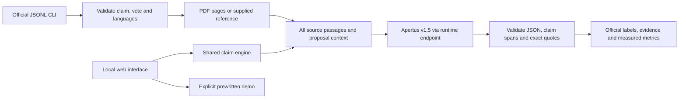

# Technical report — ClaimLens

- **Track:** Track 2A — OST: Multilingual Natural Language Inference over Swiss Official Voting Booklets
- **Event:** Hack Apertus Online, 1–16 October 2026
- **Team:** To be completed by the submitting team
- **Demo:** Local UI, `make dev` or Docker `make run`
- **Status:** Local prototype, 8 October 2026; live UI and CLI smoke checks completed; no benchmark result

## 1. Summary

ClaimLens connects a source-relative NLI verdict to the exact words behind it. The CLI implements the two official task inputs, while the optional web interface exposes whole-claim and part-by-part assessments with original-language quotations. The intended model is Apertus v1.5 8B, with 70B selectable. A small, clearly marked offline walkthrough makes the interface reviewable without a key or paid inference. No quality score is claimed.

## 2. Architecture

The application runs in Python. `booklets.py` retains PDF page positions and source-language text; `engine.py` validates findings; `llm.py` owns the only remote inference call. `cli.py` translates to and from the official contract. The static UI calls a local HTTP server. Data stays in memory during processing; the CLI writes only requested output. The predictor does not fetch documents, models, or dependencies at runtime.

The first model check must assess the entire claim. Its label determines NLI. Subsequent checks explain quantities, dates, population scope, qualifiers, or attribution. Part labels are not mechanically combined because doing so would misclassify disjunctions and conditionals. The code derives offsets from exact claim substrings and rejects invented quotations or source identifiers. This verifies provenance, not semantics.

All supplied text is sent for the first live baseline. Avoiding lexical filtering preserves evidence across language pairs and opposing sections. Future retrieval should be evaluated against this baseline. A character limit fails explicitly rather than silently removing pages. PDF extraction is cached for repeated booklet paths within a CLI batch.

## 3. Use of Apertus

- **Model:** `swiss-ai/Apertus-v1.5-8B` by default; `swiss-ai/Apertus-v1.5-70B` optional.
- **Use:** Inference only; no fine-tuning, tools, or external judge. Local development uses a downloaded community Q4_K_M text conversion of Apertus v1.5 8B (5,059,027,136 bytes), with SHA256 verified. This is not the complete multimodal checkpoint; [local model provenance](docs/local-model.md) records the conversion and revision.
- **Location:** Local llama.cpp 0.6.0 (b11429) on Apple M4, 16GiB RAM, through `http://127.0.0.1:8081/v1`. OST's runtime `BASE_URL`/`API_KEY` take precedence over local configuration. Remote proxy calls retain official model IDs; the local alias is restricted to local hosts.
- **Request:** Chat completions, temperature 0, maximum 3,000 output tokens. The local runtime constrains JSON with a schema; remote proxies receive JSON-object mode. Local highlight spans are limited to exact contiguous phrases of up to eight words or the entire claim. This constrains copying, not the predicted label. The prompt is versioned in `src/claimlens/llm.py`. The claim appears after the source passages to distinguish it from source text.

The request contains the source-language proposal name, independently specified claim language, and every passage with ID, page, language, and attribution. It instructs the model to treat source text as evidence, examine conflicting passages, preserve original quotes, and distinguish opinions or forecasts from established facts. No provider retry, browsing, or shell tool is exposed to the model.

The local server exposes one 8B model, an 8,192-token combined input/output context, and one inference slot with Apple Metal offload. Remote endpoint availability remains unverified. The default UI mode is the offline walkthrough; changing the selected model there does not run it.

## 4. Data

The walkthrough uses one real French reference from [OSTswiss/MNLIoverSwissVotingBooklets](https://huggingface.co/datasets/OSTswiss/MNLIoverSwissVotingBooklets), revision `fc2b27600310778da6bbf445651ddbca22d86269`. It concerns the 3 March 2024 retirement initiative. One dataset claim/label and three locally authored variations illustrate support, contradiction, and unresolved evidence in DE/FR/IT. All displayed explanations are prewritten. See [data/README.md](data/README.md) for attribution, hashes, and boundaries.

The source dataset declares MIT. The booklet is attributed to the Swiss Federal Chancellery. No personal participant data is collected. A task B request uses only its supplied reference. Task A uses the user-supplied local PDF; there is no automatic web retrieval. The submission image excludes all demo examples and labels.

The full upstream `train` split was downloaded with `datasets.load_dataset` at the pinned revision and saved using `save_to_disk`: **1,488 rows**, with 495 entailment, 498 neutral, and 495 contradiction examples. All nine language pairs are present. There are 335 duplicate requests (1,153 unique) and no conflicting duplicate labels. The ignored `data/local/ost/` directory separates inference inputs, gold labels, and the labeled Hugging Face snapshot; a manifest records hashes and package versions. Booklet PDFs have not been batch-downloaded. No held-out split has been created.

## 5. Evaluation

| Setup | Observation | Meaning |
| --- | --- | --- |
| Offline walkthrough | Four examples exercise all three labels and DE/FR/IT claims | Prewritten UI demonstration, not model evaluation |
| Unit and integration checks | **66 tests passed** with `make test`; mocked provider, JSONL tasks A/B, nine language pairs, PDF parsing, local aliases/schema, timeout and dataset export checks | Interface and provenance checks only |
| Original French PDF | 32 pages, 41,564 extracted characters | Extraction worked for this booklet; broader OCR/layout robustness unknown |
| Frontend | JavaScript syntax and DOM interaction harness, four local HTTP examples | Functional smoke check; no browser screenshot review |
| Docker | Docker unavailable in this environment | Build/run verification remains outstanding |
| Local Apertus CLI | Real OST row `ost-train-000000`, DE claim / FR reference: entailment (0), matching its gold label; exact quote accepted; 1,548 input tokens, 183 output tokens, 40,888 ms case duration including queue wait | One smoke case, not an accuracy estimate |
| Local Apertus UI | DE changed-number claim / FR reference: contradiction (2); 2,077 input tokens, 451 output tokens, 36,976 ms request duration | Whole-claim evidence validated; one diagnostic quote failed exact matching and was visibly downgraded |

The production CLI records provider `prompt_tokens` and `completion_tokens`, plus elapsed case milliseconds including parsing and validation. It fails if mandatory usage counts are absent, rather than substituting an estimate. UI `context_tokens` stays null when the endpoint does not report source-only token usage; source characters are counted separately. Demo runs report no model token usage. They must never be included in a model benchmark.

Next evaluation: prepare labeled cases outside the predictor, run both tasks across all nine language pairs, compute separate three-class macro-F1 and evidence overlap with the official evaluator, and compare 8B/70B on observed tokens and time. The public targets (A ≥0.60, B ≥0.70) are requirements, not achieved results.

## 6. Limitations

Real local inference has been checked on a small number of development examples. Quality across all nine language pairs is unmeasured, and the smoke examples must not be treated as held-out evaluation. Early local responses confused source text with claim text or produced invented highlights; prompt placement and local schema constraints address those structural failures. Citation failures remain possible, as observed in the UI check. A valid exact quote can still be misinterpreted. Strict quote matching can reject paraphrases or PDF whitespace variations. Invalid citations are shown as unresolved validation issues in the UI and rejected by the submission CLI; structural errors reject the whole response.

The prototype has no OCR. Image-only PDFs fail; mixed scanned/text PDFs may omit text embedded only as images. PDF extraction may scramble columns or hyphenation. The application cap is 300,000 source characters, not an exact model token budget. The local runtime's 8,192-token context is smaller and includes both input and output; longer references and full booklets can exceed it. Context shifting is disabled. Other limits are 200 pages, 25 MB per PDF, 2,000 claim characters, and 3,000 completion tokens. Repeated identical claim spans currently resolve to their first occurrence.

The local HTTP server is intended for a single-user prototype. It has no deployment authentication or service scaling. Docker and visual browser rendering still need direct verification. The Markdown report must be reviewed and exported to the required maximum-six-page PDF before submission.

## 7. Reproducibility

Preserve the template's `track_2a/` layout. Run `make test` and `make demo` for offline checks. `make run` launches the demo container; `make submission` produces a `linux/amd64` CPU predictor without gold labels. Supply only inference inputs read-only at `/data`, runtime model credentials, and a writable `/output` mount. Dependencies are installed at image build time, with `pypdf==6.19.0` pinned. Local Python 3.9.6 and the project's virtual environment were used for validation; Docker targets Python 3.12.

For local inference, run `make model-serve`, then `make dev` in another terminal. `make model-pull` verifies/reuses or downloads the pinned GGUF. The full dataset is stored in `data/local/ost/dataset`; `requirements-data.txt` pins download dependencies. Local smoke artifacts are in the ignored `output/local-smoke/` directory. The CLI smoke used only an exported unlabeled input; the label was compared after prediction.

Temperature is zero; inference may still be nondeterministic. No benchmark seed is relevant until an actual evaluation split is selected. Record the final repository commit, endpoint/model revision, and evaluation input hashes when running the first baseline. The starting template commit is `7f2382275461baf3fa6c8855d157d86abffe9f0e`; no source commit has been fabricated for this uncommitted prototype.

## 8. Next steps

1. Establish a held-out evaluation plan accounting for duplicate requests and shared booklets; the downloaded upstream split is named `train`.
2. Validate Docker on the judging architecture and mounts, then test task A on several actual booklets.
3. Evaluate every language pair, failure rate, citation coverage, macro-F1, tokens, and time.
4. Tune prompts/structured output based on observed failures; compare full context with retrieval only after establishing a measured baseline.
5. Complete team metadata and export the final report PDF for the 16 October deadline.

## License

Project source code: Apache-2.0, using the template's root `LICENSE`. Project documentation: Creative Commons Attribution 4.0 (CC-BY-4.0). Imported data retains its original license and attribution. Before submitting a new generated dataset, follow the event's CDLA-Permissive-2.0 requirement and preserve third-party rights.

## References

- [Official project template](https://github.com/HackApertus/project-template)
- [OST challenge](https://hackapertus.notion.site/3deb4fec112a80258fd2ddc61616011d)
- [Official solution API guide](https://hackapertus.notion.site/solution-api-guide-ef5b4fec112a834da43101ede56300f5)
- [Official starter and evaluator](https://gitlab.com/ifsoftware/hackapertus-starter)
- [OST dataset](https://huggingface.co/datasets/OSTswiss/MNLIoverSwissVotingBooklets)
- [Apertus v1.5 model card](https://huggingface.co/swiss-ai/Apertus-v1.5-8B)
- [Federal Chancellery booklet archive](https://www.bk.admin.ch/de/sammlung-der-abstimmungsbuechlein-seit-1978)
